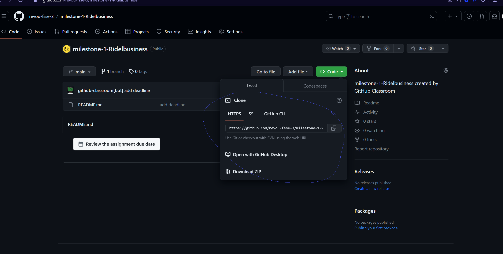
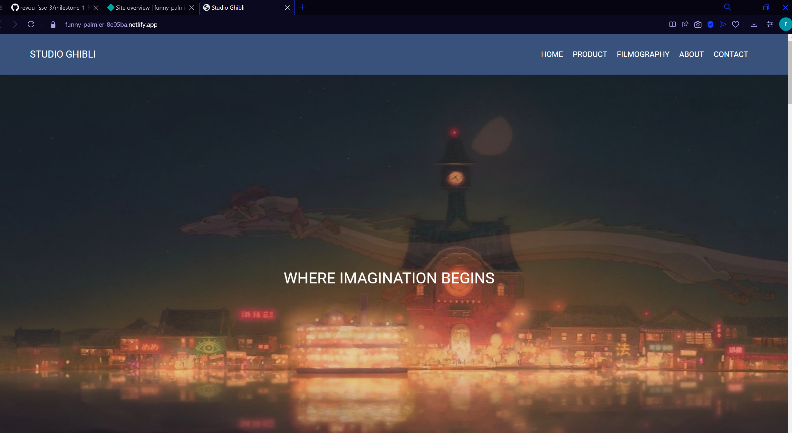
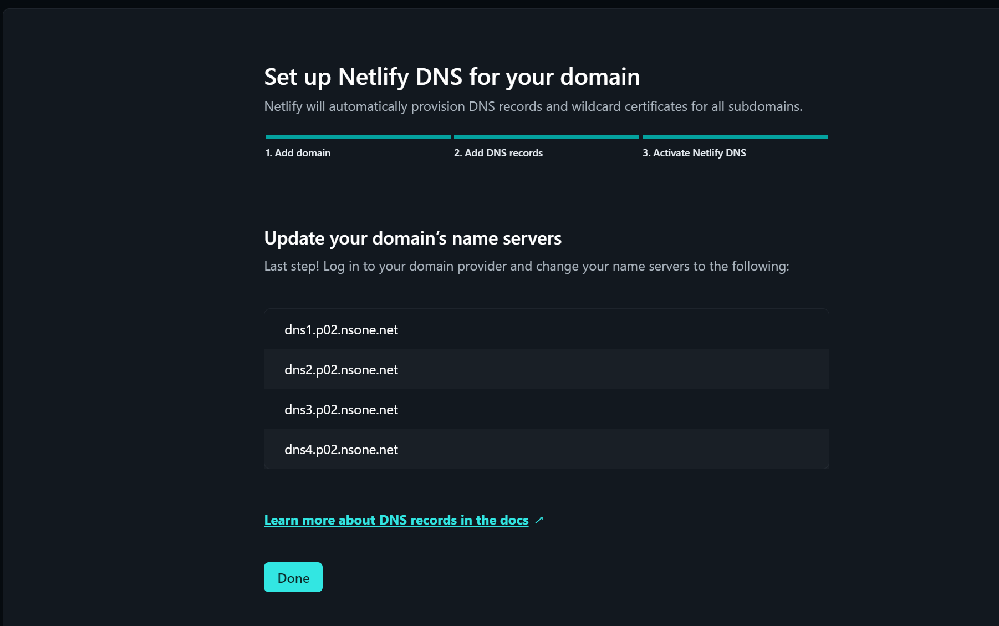

# DEPLOYMENT  

The project has been successfully deployed using Netlify. You can access the production version of the website by following this link: [http://bronya.site](http://bronya.site) 

or this free site link: [funny-palmier-8e05ba.netlify.app](https://funny-palmier-8e05ba.netlify.app).

## Github deployment
1. Create Repo in Github and then clone it to local

2. find your local folder and open git bash 

3. git add , commit, and push to your repo

4. check the github repo

## Connect Netlify to your Github project

1. Login to Netlify

2. Add New Site

3. Deploy With Github

4. Pick the repo you want

5. Deploy the repo

6. wait for the site ready

7. after ready click the site

## Set Up Domain Netlify And Niagahoster

1. Login to Niagahoster and pick the domain

2. In Netlify click set custom domain

3. Add a custom domain to your site

4. Enter the domain management

5. Click awaiting external DNS

6. Set up Netlify DNS for bronya.site

7. Verify the dns and when you get the Nameserver save it

8. Go back to Niagahoster and enter the DNS tab

9. Change nameservers with DNS we get from Netlify

10. wait for domain propagation

11. After the site done check again

